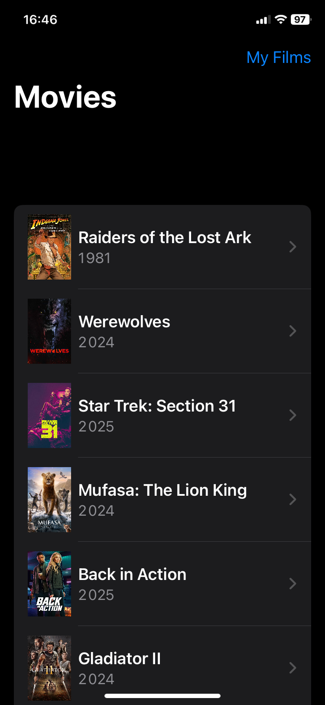
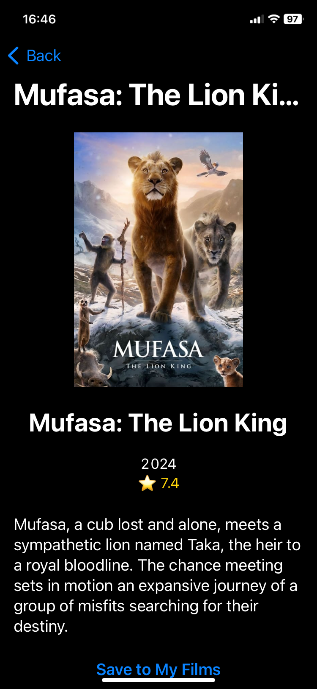
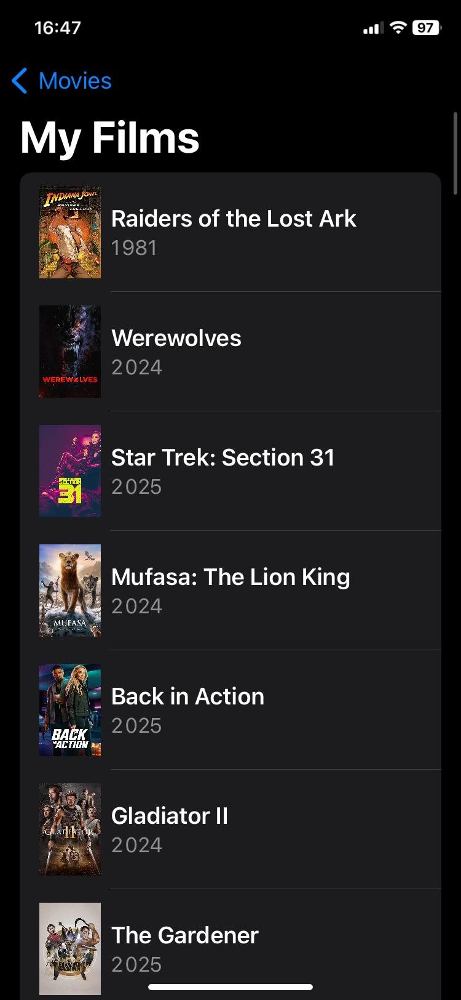

# 🎬 MyFilms  

MyFilms is a modern iOS application built with SwiftUI and Core Data, allowing users to explore movies and save their favorites for later. It fetches movies from **The Movie Database (TMDb) API** and provides an intuitive way to browse and manage films.  

--- 

### 🎥 Movie List  
Browse through the latest movies fetched from TMDb.  

### 📄 Movie Details  
View in-depth details about a selected movie, including its poster, description, release year, rating, and more.  

### ⭐ My Saved Films  
Save your favorite movies and access them anytime in the **My Films** section.  

---

## 🚀 Features  

✅ **Fetch all movies** from TMDb (not just popular ones).  
✅ **Detailed movie pages** with high-quality posters and descriptions.  
✅ **Save movies** to your personal collection using Core Data.  
✅ **Seamless UI navigation** with SwiftUI.  

---

## 🛠️ Installation  

1. Clone the repository:  

   git clone https://github.com/dnlmor/MyFilmsStock.git
   cd MyFilmsStock

Open myfilms.xcodeproj in Xcode.

Run the app on a simulator or a real device.

## 🔗 API Configuration
This app uses The Movie Database (TMDb) API.

To run it, ensure you have a valid API key in TMDBService.swift:

    let apiKey = "your_api_key_here"

If you don't have an API key, get one from TMDb